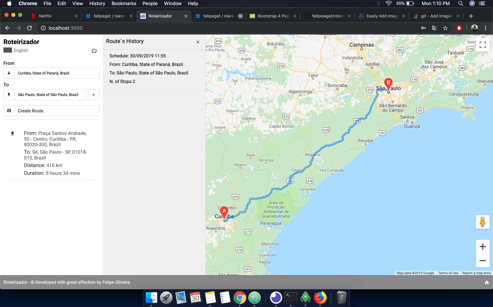

# Roteirizador

## Sobre

Este projeto é um roterizador, desenvolvivdo com NodeJs, ReactJs, vinculado com o GoogleMaps API e como banco de dados, o MongoDB, através dele é possivel criar rotas, criar um usuario, mudar entre as linguagens português, inglês e francês, visualizar um histórico de rotas. Este projeto foi desenvolvido para Fingerprint Digital, como um teste de candidatura para uma vaga.

### Funcionalidades

- Criar rotas a partir de origem, destino e paradas

### Ambiente para Rodar o Projeto

- Voce vai precisar do Redis, Node, MongoDB e ReactJs instalado.
- Use npm i ou yarn i para instalar o as dependencias
- Crie um db NO MongoDB chamado roteirizador( as collections serão criadas automaticamente )
- Inicie o BackEnd Node, o projeto se encontra neste link: https://github.com/felipewget/roteirizador-server

### Iniciando o projeto

- Após iniciar o BackEnd Node, basta digitar np Terminal/CMD <b>npm run start</b> e o projeto irá rodar em http://localhost:3000

### Observacōes e melhorias

- Não usei Hooks e devia ter usado mais
- Criar um .env para a rota do backend nas actions e tambem keys
- Subestimei o projeto, pensei que em 5 horas iria estar pronto... e nao subi progressivamente atualizacoes no Git
